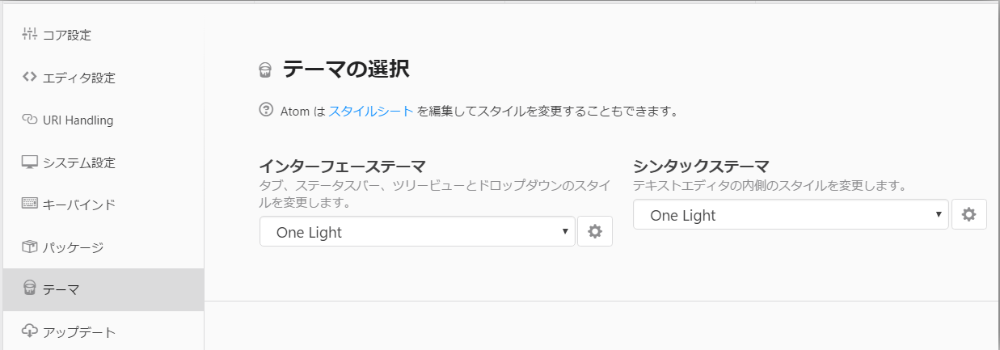
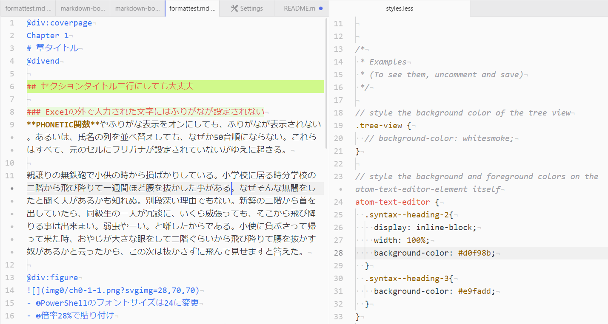

# language-mdbp
markdown grammer for MDBP with ATOM

Markdownのシンタックスハイライトを日本語文に合わせてカスタマイズしています。

## 変更点

- **太字**と*斜体*の使用時に、半角スペースを空けないと認識しない問題に対処しました。
- @div:～@divendの範囲の色が変わるよう指定（entity.name.section.gfm）。使用しているシンタックステーマによって変化します。

## スニペット
GiHub Markdownのスニペットの他に以下を追加しました。

| prefix | 意味|入るもの |
|--   |-- |-- |
| cov | 章扉 | @div:coverpage|
| sec | 節見出し |@div:secheader|
| fig | 図版領域 |@div:figure|
| col | コラム |@div:column|
| de  | @divの閉じタグ |@divend|

## Markdownの見出しをもう少し見やすくする
テーマを作るほどもないのですが、文書が長くなってくると見出しが目立たないと構造を把握しにくので、h2とh3用のスタイルを目立つようにして使っています。

環境設定画面の［テーマ］からスタイルシート（style.css）を開きます。


atom-text-editorの中に、h2とh3用のスタイルを追加します。


```css
atom-text-editor {
  .syntax--heading-2{
    display: inline-block;
    width: 100%;
    background-color: #d0f98b;
  }
  .syntax--heading-3{
    background-color: #e9fadd;
  }
}
```
